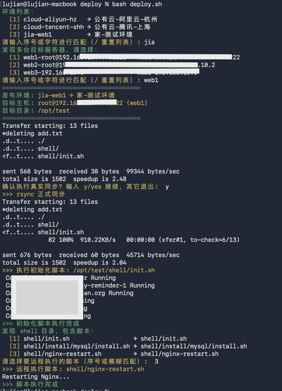
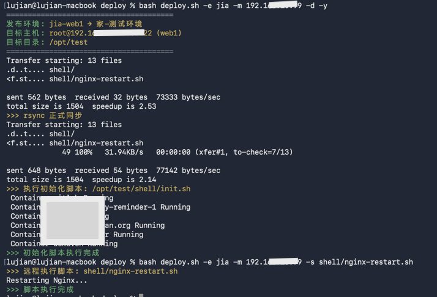

# deploy.sh - 自动化部署控制脚本

**这是一个日常工作中高频使用的自动化部署脚本**

- 交互式操作：支持环境选择、服务器选择、文件发布和远程脚本执行
- CI/CD 集成：支持命令行参数的无交互执行模式





## 概述

[deploy.sh](file:///Users/lujian/Downloads/deploy/deploy.sh) 是一个用于将本地项目文件同步到远程服务器的自动化部署脚本，支持在远程服务器上执行初始化或自定义脚本。该脚本提供多环境、多服务器选择以及远程脚本执行功能，支持交互式选择和命令行参数两种操作方式。

### 主要功能

- **文件同步**：将本地环境目录同步至远程服务器
- **多服务器支持**：支持多台服务器选择，可按序号或名称匹配
- **多环境管理**：支持环境选择，可按目录名或显示名匹配
- **远程脚本执行**：支持远程执行初始化脚本和自定义 shell 脚本
- **自动化部署**：支持 `--yes` 参数自动确认同步
- **灵活配置**：可通过 `.env` 文件配置每个环境的服务器信息和目标路径

---

## 文件结构

```
install/                       # 根目录
├── deploy.sh                  # 主发布控制脚本
├── rsync_ignore.txt            # rsync 排除文件列表
├── common/                     # 公共文件目录，所有环境共享
│   ├── shell/                  # 公共 shell 脚本
│   │   ├── init.sh             # 公共初始化脚本示例
│   │   └── deploy.sh           # 公共部署脚本示例
│   └── …                       # 公共其他文件
├── cloud-aliyun-hz/            # 环境目录示例
│   ├── .env                    # 环境配置文件
│   ├── shell/                  # 环境专属 shell 脚本
│   │   ├── docker-compose-up.sh
│   │   └── docker-compose-down.sh
│   └── …                      # 环境特有文件
├── cloud-tencent-sh/          # 另一个环境目录示例
│   ├── .env
│   ├── shell/
│   │   ├── start.sh
│   │   └── stop.sh
│   └── …
└── …                          # 其他环境目录
```

### 文件说明

- **deploy.sh**：部署脚本主程序，支持文件同步与远程脚本执行
- **rsync_ignore.txt**：rsync 排除规则，指定不需要同步的文件或目录（如 `.git`, `.svn`, `.idea` 等）
- **common/**：公共资源目录，存放所有环境共享的文件和脚本(同步时会将common与{env}合并同步到目标服务器，重名以环境目录内文件优先)
- **{env}/**：环境目录，每个环境独立，存放环境配置 `.env` 和专属 shell 脚本
  - **.env**：环境配置文件，定义 IP、SSH 端口、用户名、目标目录、初始化脚本等
  - **shell/**：环境专属可执行脚本，如初始化或部署脚本
  - **其他文件**：其他环境特有文件
- **其他环境目录**：可按相同结构创建多环境，如 `cloud-tencent-sh/`

---

## 环境配置示例 `.env`

```bash
# 环境显示名称
NAME="公有云-阿里云-杭州"
# 服务器 IP 列表，逗号分隔
IP="1.2.3.4"
# SSH 端口，默认 22
PORT=22
# SSH 用户名，默认 root
USERNAME="root"
# 发布目标目录，默认 /opt/install
TARGET_DIR="/opt/install"
# 可选：初始化脚本路径，相对 TARGET_DIR
INIT_SCRIPT="shell/init.sh"
```

## 使用方法

### 基本语法

```bash
./deploy.sh [OPTIONS]
```

### 参数说明

| 参数 | 描述 |
|------|------|
| `-h, --help` | 显示帮助信息 |
| `-e, --env <env>` | 指定发布环境 |
| `-m, --machine <machine>` | 指定目标服务器，可包含别名、用户名、端口，例如 `prod-server@192.168.1.10:2222` |
| `-d, --deploy` | 仅执行文件同步部署 |
| `-y, --yes` | 自动确认部署，跳过交互确认 |
| `-s, --script <script>` | 仅执行远程脚本，可指定脚本路径，支持模糊匹配或序号选择 |

> **注意**：
> - 默认情况下，部署与脚本执行功能都启用
> - 若单独指定 `-d` 或 `-s`，另一个功能可根据需要保持默认或禁用
> - `--yes` 可用于非交互式部署

### 使用示例

#### 1. 交互式部署

```bash
# 交互式选择环境和服务器
./deploy.sh
```

#### 2. 指定环境部署

```bash
# 指定环境并部署
./deploy.sh -e cloud-aliyun-hz -d

# 指定环境和远程服务器
./deploy.sh -e cloud-aliyun-hz -m 1.2.3.4 -d
```

#### 3. 执行远程脚本

```bash
# 执行指定的远程脚本
./deploy.sh -e cloud-aliyun-hz -s shell/nginx-restart.sh
```

#### 4. 自动化部署

```bash
# 自动确认部署（跳过交互确认）
./deploy.sh -e cloud-aliyun-hz -d -y
```

---

## 版本信息

- **作者**：lujian
- **邮箱**：lujian0571@gmail.com
- **GitHub**：https://github.com/lujian0571